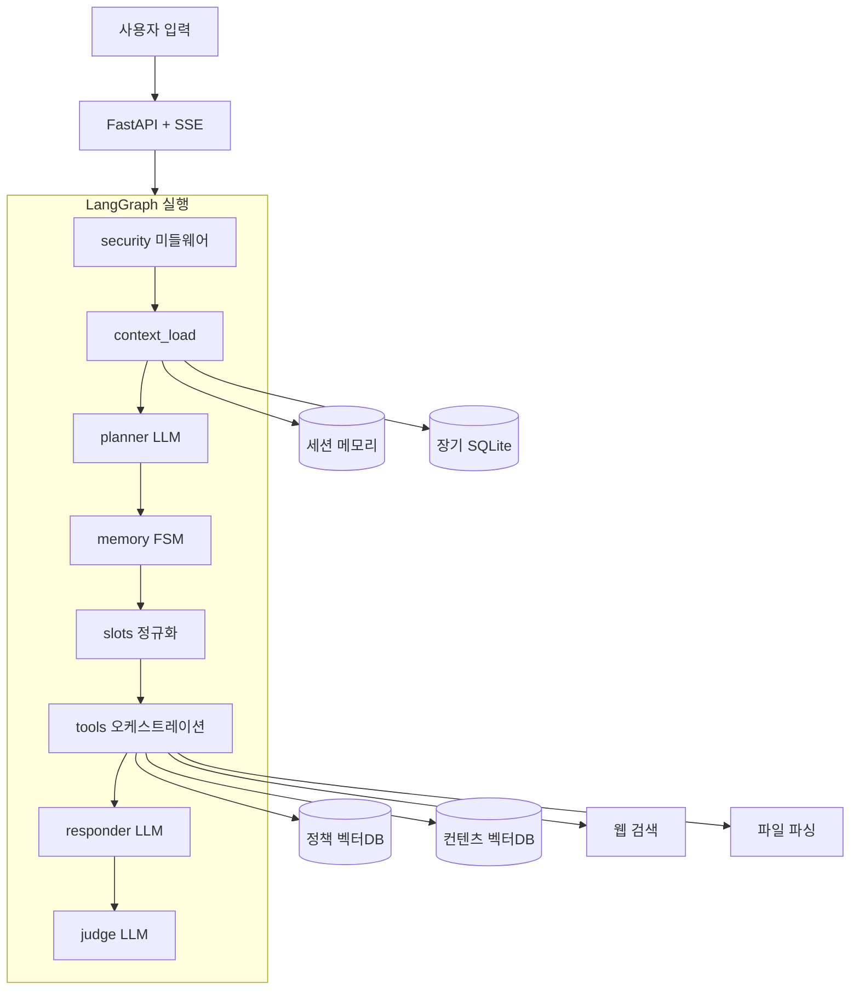
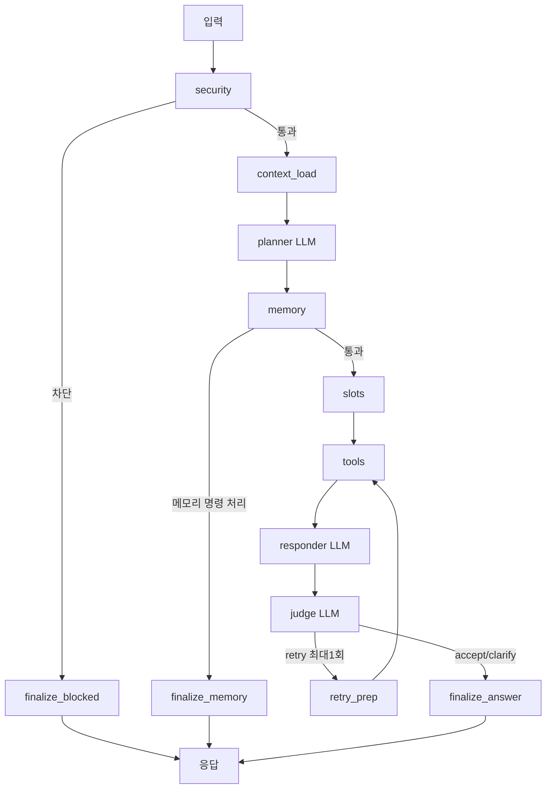
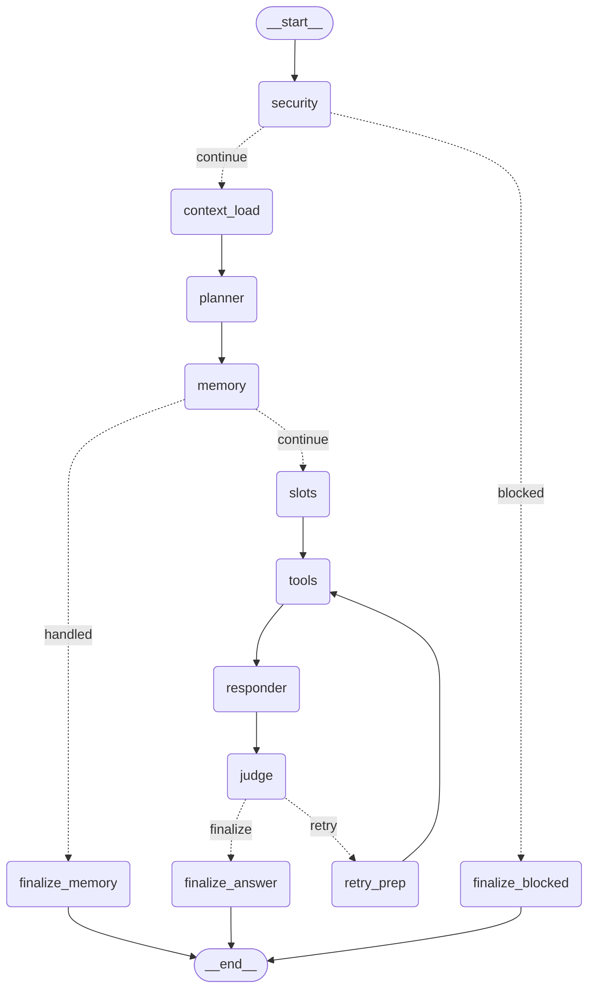

# 청년정책 Agent 서비스 (LangChain / LangGraph)

자연어 요청을 받아 **청년 정책·컨텐츠를 검색·추천**하고, 멀티턴 대화 맥락과 장기기억을 반영해 답변하는 Agent 서비스입니다.
전체 실행 흐름은 **LangGraph `StateGraph`** 로 설계했으며, 조건부 분기와 재시도 루프, RAG, 메모리, 미들웨어, 구조화 출력(OutputParser)을 포함합니다.

> 제출 본체: **`agent3`** (LangGraph StateGraph 구현, 단독 실행)
> `agent3`는 스태지/RAG/LLM/메모리/매핑 모듈과 데이터(벡터스토어)를 모두 자체 포함하며, 다른 폴더 의존 없이 독립 실행됩니다.

---

## 1. 서비스 소개 및 사용 시나리오

### 서비스 소개
- 사용자의 자연어 질문을 **작은 Planner LLM**이 분석해 의도·도구 계획·필요 정보를 스스로 결정합니다.
- 청년 정책과 컨텐츠(공지/모집/소식)를 **분리된 RAG 인덱스**로 검색하고, 필요 시 웹 검색·파일 파싱을 병행합니다.
- 대화 이력(세션)과 **유저코드 기반 장기기억**을 반영해 맞춤 추천 품질을 높입니다.
- 마지막에 **Judge LLM**이 답변 정합성을 평가하고, 필요하면 재검색 루프를 1회 수행합니다.

### 대표 사용 시나리오
1. 맞춤 정책 추천: "서울 27살 미혼, 취업지원 정책 추천해줘"
2. 컨텐츠 탐색: "청년 대상 공지/모집 소식 알려줘"
3. 문서 기반 상담: 파일 업로드 후 "이 내용 기준으로 받을 수 있는 정책 알려줘"
4. 기억 기반 대화: 장기기억 활성화 후 다음 대화에서 프로필 자동 반영

---

## 2. 요구사항 충족 요약

| 과제 요구사항 | 구현 위치 | 충족 |
|---|---|---|
| Tool 2개 이상 자율 선택·실행 | `rag_policy_search`, `rag_content_search`, `web_search`, `file_parse` | O (4개) |
| RAG 파이프라인 1개 이상 | 정책/컨텐츠 분리 Chroma 인덱스 + 재랭킹 | O (2개) |
| 멀티턴 메모리 | 세션 메모리 + 유저코드 장기 SQLite | O |
| LangGraph StateGraph + 조건부 분기 | `agent3/graph/graph_builder.py` (분기 3곳) | O |
| 반복(loop) | `judge → retry_prep → tools` (최대 1회) | O |
| Middleware 1개 이상 | 보안 필터/입력검증/메모리 확인/예외처리 | O |
| OutputParser 구조화 출력 | LangChain `JsonOutputParser` (`invoke_json`) | O |
| API Key 분리 (.env) | `.env` 로드, 하드코딩 없음 | O |
| requirements.txt | 루트에 포함 | O |
| Workflow 다이어그램 | 본 README + `draw_mermaid()` 출력 + HTML 보고서 | O |

---

## 3. 전체 아키텍처



---

## 4. Workflow 다이어그램

### 4-1. 논리 흐름 (조건부 분기 + 루프)



### 4-2. 코드로 생성된 그래프 (`get_graph().draw_mermaid()`)

아래는 컴파일된 그래프에서 직접 출력한 결과입니다.

```
python -c "from agent3.graph import build_graph; print(build_graph().get_graph().draw_mermaid())"
```



---

## 5. 사용된 Tool / RAG / Memory / Middleware

### Tool (자율 선택, 복수 동시 실행 가능)
- `rag_policy_search`: 정책 전용 RAG 검색 + 하드조건 감점/유사도 가점 1차 평가
- `rag_content_search`: 공지/모집/소식 컨텐츠 전용 RAG 검색
- `web_search`: 최신성·용어 보완용 웹 검색
- `file_parse`: 업로드 파일(txt/pdf/이미지) 텍스트 추출

### RAG
- 정책/컨텐츠를 **분리 Chroma 인덱스**로 운영
- 임베딩: `text-embedding-3-small`
- 정책 검색 시 **하드조건(지역/나이/결혼/소득/분야) 불일치 감점 + 제목/본문 의미 유사도 가점**
- 1차 추림 후 Judge LLM이 최종 정합성 평가

### Memory
- **단기**: 세션 대화창(in-memory)을 컨텍스트에 주입
- **장기**: 유저코드 기반 SQLite에 프로필·요약·최근대화 저장
- 활성화/수정/삭제는 **동의·취소 확인 절차**를 강제

### Middleware
- **입력 검증/가드레일**: 주민번호·휴대폰·여권·신용카드 패턴, 입력 길이 차단 (`security` 단계)
- **메모리 확인 절차**: 장기기억 제어 시 확인/취소 강제 (`memory` FSM)
- **예외 처리**: 개별 툴 실패 격리, API 예외 반환, 스트리밍 에러 이벤트

### OutputParser (구조화 출력)
- LangChain **`JsonOutputParser`** 를 1차 파서로 사용해 LLM 출력을 구조화 (`agent2/llm/client.py`의 `invoke_json`)
- Planner LLM: 의도/툴계획/슬롯을 **JSON**으로 파싱
- Judge LLM: `decision/refined_query/clarifying_question`를 **JSON**으로 파싱

---

## 6. 설치 및 실행 방법

### 1) 가상환경 + 의존성
```bash
python -m venv .venv
# Windows PowerShell
.\.venv\Scripts\Activate.ps1
pip install -U pip
pip install -r requirements.txt
```

### 2) 환경변수 (.env)
루트에 `.env` 생성 후 키 입력 (하드코딩 금지):
```
OPENAI_API_KEY=sk-...
# 선택
GOOGLE_API_KEY=...
ANTHROPIC_API_KEY=...
TAVILY_API_KEY=...
```

### 3) 실행 (LangGraph 버전 = 제출 본체)
```bash
python -m agent3.run_server
```
- UI: `http://localhost:8002`
- API Docs: `http://localhost:8002/docs`
- 동작 보고서(다이어그램): `http://localhost:8002/static/agent3_report.html`
  - 채팅 화면 우상단 **📊 보고서** 버튼으로도 이동 가능

---

## 7. API 사용 예시

### 채팅
```bash
curl -X POST http://localhost:8002/api/chat \
  -H "Content-Type: application/json" \
  -d '{"user_id":"u1","query":"서울 27살 청년 취업정책 추천"}'
```

### 스트리밍(SSE, 단계별 진행 이벤트)
```bash
curl -N -X POST http://localhost:8002/api/chat/stream \
  -H "Content-Type: application/json" \
  -d '{"user_id":"u1","query":"청년 컨텐츠 최신 소식 알려줘"}'
```

---

## 8. 폴더 구조 (핵심)

```
agent3/
  graph/graph_builder.py   # LangGraph StateGraph 정의 (분기/루프)
  service.py               # 그래프 실행 + 영속화 + SSE
  pipeline/stages/         # 단계(Stage) 구현 (보안/플래너/메모리/툴/응답/판정)
  rag/                     # 정책/컨텐츠 분리 RAG 검색·평가
  llm/                     # 모델 팩토리 + OutputParser + 컨텍스트 윈도우
  store/                   # 세션/장기 SQLite 메모리
  mapping/                 # 슬롯 정규화 맵핑
  config/settings.py       # .env 기반 설정(경로/모델/키)
  data/                    # 벡터스토어(정책/컨텐츠) + SQLite
  api/app.py               # FastAPI 라우트
  run_server.py            # 서버 실행 (포트 8002)
  static/                  # 채팅 UI + 보고서 HTML
requirements.txt
.env                       # API Key (git 제외)
```

---

## 9. 한계점 및 향후 개선 방향

### 한계점
- 장기기억 요약이 현재 규칙 기반이라 LLM 요약 대비 품질이 제한적입니다.
- RAG 정량 평가셋(Precision@K 등)이 아직 문서화되지 않았습니다.
- 웹 검색은 키(TAVILY) 설정 시에만 동작합니다.

### 개선 방향
1. 장기기억 요약을 LLM 기반으로 교체
2. RAG 오프라인 평가셋 구축(Precision@K, NDCG, 조건 일치율)
3. 미들웨어 확장(레이트리밋, 요청 추적 ID, 감사 로그)
4. pytest 기반 통합/회귀 테스트 자동화

---

## 10. 사용 라이브러리 및 출처

- FastAPI, Uvicorn
- LangChain, LangGraph
- langchain-openai / langchain-google-genai / langchain-anthropic
- ChromaDB, Pydantic, python-dotenv

외부 오픈소스는 표준 라이브러리 용도로만 사용했으며, 코드 복제 없이 직접 구현했습니다.
버전은 `requirements.txt`에 명시되어 있습니다.
